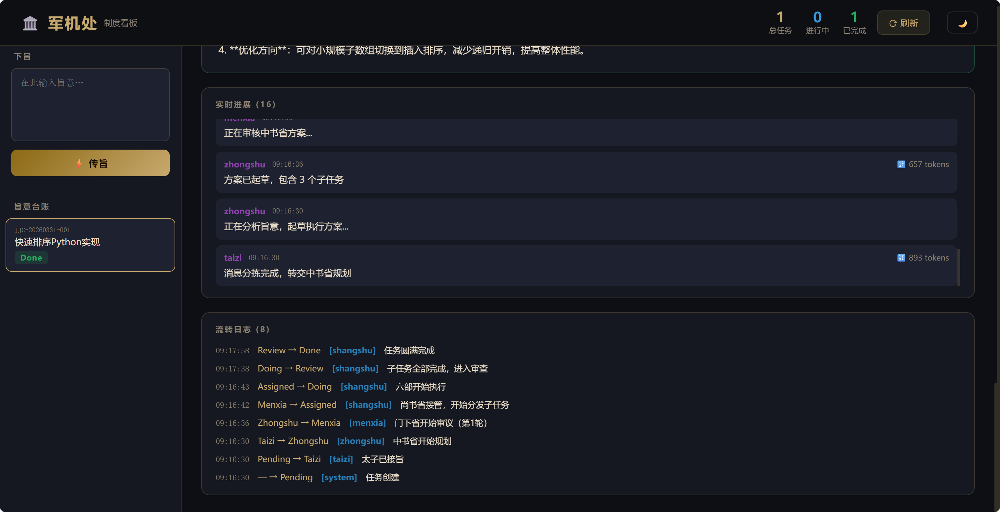
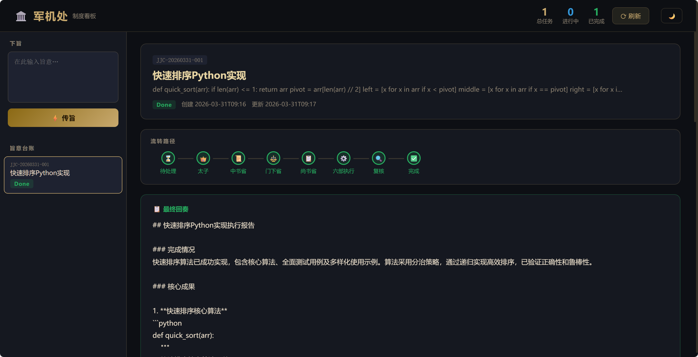

# 可插拔制度多 Agent 编排系统

> 以中国古代政治制度为设计灵感的 **多 Agent 协作系统**。支持多种制度模块可插拔切换：三省六部制、民主集中制等。用 LLM 驱动角色模拟任务分拣、方案规划、审核驳回、任务分发与执行汇聚的完整工作流。完全独立，零外部框架依赖。

[](https://www.python.org/downloads/)
[](LICENSE)

---

## ✨ 特性

- **可插拔制度模块** — 内置多种制度（三省六部制、民主集中制），一个配置切换，也可自行扩展新制度
- **零框架依赖后端** — 纯 Python 标准库 HTTP 服务，`pip install -r requirements.txt` 即可运行
- **多 LLM 支持** — OpenAI / Anthropic / DeepSeek / Ollama / 任意兼容接口，一个配置切换
- **完整工作流引擎** — 每种制度有独立的状态机、角色定义、Agent 逻辑和编排流水线
- **Web 看板 UI** — Vue 3 + Vite 前端，深色/浅色主题切换，实时查看任务流转、进展日志
- **命令行 & 交互式终端** — 支持 dashboard / 单次运行 / 交互模式 / 列出制度四种使用方式
- **一键启动** — `start.bat` 或 `python start.py` 同时启动前后端
- **状态机 + 持久化** — 任务全生命周期状态管理，JSON 文件持久化，重启不丢失

## 🏛️ 内置制度

### 三省六部制（默认）

> 隋唐 · 决策、审核、执行三者严格分离

```
用户旨意
  │
  ▼
👑 太子 (Taizi)          ← 消息分拣：闲聊 or 正式任务
  │
  ▼
📜 中书省 (Zhongshu)     ← 规划方案，拆分子任务
  │
  ▼
⚖️ 门下省 (Menxia)       ← 审核方案（可封驳，最多3轮）
  │
  ▼
📋 尚书省 (Shangshu)     ← 分发给六部执行并汇总
  │
  ├─▶ 💰 户部 (hubu)     — 数据/资源
  ├─▶ 📚 礼部 (libu)     — 文档/规范
  ├─▶ ⚔️ 兵部 (bingbu)   — 代码/工程
  ├─▶ 🔒 刑部 (xingbu)   — 安全/合规
  ├─▶ 🏗️ 工部 (gongbu)   — 基础设施
  └─▶ 👤 吏部 (libu_hr)  — 人员/评估
  │
  ▼
汇总审核 → ✅ Done
```

### 民主集中制

> 现代 · 民主讨论与集中决策相结合

```
用户消息
  │
  ▼
📋 秘书处 (Secretary)    ← 消息分拣
  │
  ▼
🏛️ 议会 (Congress)       ← 多部门讨论投票
  │   ├── 工业部
  │   ├── 科技部
  │   ├── 文化部
  │   └── 安全部
  │
  ▼
🎯 常务委员会 (Committee) ← 集中决策
  │
  ▼
⚙️ 执行部委 (Executor)    ← 按方案执行
  │
  ▼
📊 监察部 (Auditor)       ← 事后审计
  │
  ▼
✅ Done
```

## 📸 界面预览


*军机处看板 - 实时任务流转与进展日志*


*任务详情 - 状态流程可视化与最终结果展示*

## 🚀 快速开始

### 1. 克隆项目

```bash
git clone https://github.com/havocio/edict-standalone.git
cd edict-standalone
```

### 2. 安装依赖

```bash
pip install -r requirements.txt
```

### 3. 配置 LLM

```bash
cp .env.example .env
# 编辑 .env，填入你的 API Key 和模型配置
```

支持的 LLM 提供商：

| 提供商 | `LLM_PROVIDER` | 说明 |
|--------|---------------|------|
| OpenAI | `openai` | GPT-4o / GPT-3.5 等 |
| Anthropic | `anthropic` | Claude 系列模型 |
| DeepSeek | `deepseek` | deepseek-chat / deepseek-coder |
| Ollama | `ollama` | 本地模型，无需 API Key |
| 智谱 AI | `openai` + `LLM_BASE_URL` | GLM 系列，使用兼容接口 |

> 💡 使用任意 OpenAI 兼容 API 时，只需设置 `LLM_BASE_URL` 为对应的 endpoint 即可。

### 4. 启动

**一键启动**（推荐，同时启动前后端）：
```bash
# Windows 双击 start.bat
# 或命令行
python start.py

# 访问 http://127.0.0.1:5173（前端开发服务器）
# 后端 API http://127.0.0.1:7891
```

**生产模式**（构建后运行）：
```bash
# Windows 双击 start-build.bat
# 或命令行
python start.py --build

# 访问 http://127.0.0.1:7891
```

**手动启动后端**：
```bash
python main.py
# 浏览器访问 http://127.0.0.1:7891
```

**前端开发**（热更新）：
```bash
cd dashboard-ui
npm install
npm run dev      # 开发服务器 http://127.0.0.1:5173
```

**构建前端**：
```bash
cd dashboard-ui
npm run build    # 输出到 dashboard/static/
```

**命令行单次运行**（默认制度）：
```bash
python main.py run "帮我写一个 Python 快速排序，并附上单元测试"
```

**使用指定制度运行**：
```bash
python main.py run "帮我分析一下React和Vue的优劣势" --regime democratic_centralism
```

**交互式终端**（指定制度）：
```bash
python main.py chat --regime democratic_centralism
```

**列出所有可用制度**：
```bash
python main.py regimes
```

## 📁 项目结构

```
edict-standalone/
├── main.py                  # 程序入口（支持 dashboard / run / chat / regimes）
├── start.py                 # 一键启动脚本（前后端）
├── start.bat                # Windows 开发模式启动
├── start-build.bat          # Windows 生产模式启动
├── logger.py                # 统一日志配置
├── requirements.txt         # Python 依赖
├── .env.example             # 环境变量模板
├── framework/               # 制度框架（核心抽象层）
│   ├── __init__.py          # 导出核心类
│   ├── core.py              # Regime Protocol、注册器、数据结构
│   └── task_store.py        # 通用任务存储（状态机由制度动态注入）
├── regimes/                 # 制度模块（每个子目录一个制度）
│   ├── __init__.py          # 制度发现与加载器
│   ├── san_sheng_liu_bu/    # 三省六部制
│   │   ├── __init__.py      # 注册制度
│   │   ├── regime.py        # 元数据（角色、状态机、流程）
│   │   ├── agents.py        # 各角色的 Prompt 和调用逻辑
│   │   └── orchestrator.py  # 流水线编排
│   └── democratic_centralism/  # 民主集中制
│       ├── __init__.py
│       ├── regime.py
│       ├── agents.py
│       └── orchestrator.py
├── scripts/                 # 兼容层（重导出 framework）
│   ├── __init__.py
│   ├── agents.py            # 保留（向后兼容）
│   ├── llm_client.py        # LLM 统一封装
│   ├── orchestrator.py      # 委托给当前制度模块
│   └── task_store.py        # 重导出 framework.task_store
├── dashboard_server.py      # 纯 Python HTTP 服务器
├── dashboard-ui/            # Vue 3 + Vite 前端源码
│   ├── src/
│   │   ├── components/      # Vue 组件
│   │   ├── stores/          # Pinia 状态管理
│   │   ├── types/           # TypeScript 类型
│   │   ├── App.vue          # 根组件
│   │   └── main.ts          # 入口
│   ├── package.json
│   └── vite.config.ts
├── docs/
│   └── images/              # 文档图片
└── test/
    └── api.py               # API 连接测试脚本
```

## 🔧 环境变量

在 `.env` 文件中配置：

| 变量 | 必填 | 默认值 | 说明 |
|------|------|--------|------|
| `LLM_PROVIDER` | 是 | `openai` | LLM 提供商：openai / anthropic / deepseek / ollama |
| `LLM_MODEL` | 是 | `gpt-4o` | 模型名称 |
| `LLM_API_KEY` | 是* | — | API Key（ollama 不需要） |
| `LLM_BASE_URL` | 否 | — | 自定义 API 地址（中转/Ollama） |
| `DASHBOARD_HOST` | 否 | `127.0.0.1` | Dashboard 监听地址 |
| `DASHBOARD_PORT` | 否 | `7891` | Dashboard 监听端口 |
| `REGIME` | 否 | `san_sheng_liu_bu` | 制度 ID：san_sheng_liu_bu / democratic_centralism |

## 🔌 开发新制度模块

每个制度模块只需 4 个文件，放在 `regimes/<your_regime_id>/` 下：

```
regimes/your_regime/
├── __init__.py          # 注册制度: RegimeRegistry.register("your_regime")(YourRegime)
├── regime.py            # 实现 Regime 协议: meta 属性 + dispatch 方法
├── agents.py            # 各角色的 Prompt 和 LLM 调用逻辑
└── orchestrator.py      # 流水线编排（可调用 agents 中的函数）
```

制度模块需要：

1. **定义 `RegimeMeta`**：角色、状态、状态机、流程步骤
2. **实现 `Regime` 协议**：`meta` 属性 + `dispatch()` 方法
3. **在 `__init__.py` 中注册**

参考 `regimes/san_sheng_liu_bu/` 或 `regimes/democratic_centralism/` 的实现。

## 🤝 贡献

欢迎提交 Issue 和 Pull Request！无论是新增制度模块、修复 Bug 还是改进文档。

1. Fork 本仓库
2. 创建特性分支 (`git checkout -b feature/amazing-feature`)
3. 提交更改 (`git commit -m 'Add some amazing feature'`)
4. 推送到分支 (`git push origin feature/amazing-feature`)
5. 发起 Pull Request

## 📄 License

[MIT](LICENSE)
